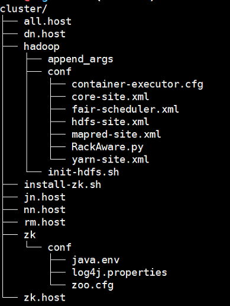

## 准备  

1. 与zookeeper 准备相同，在主控机上准备下面目录信息。  

   

2. 将nn、dn/nm、jn、rm的主机名放入cluster目录的nn.host、dn.host、jn.host、rm.host文件中。  all.host为所有主机.   

3. 讲机架信息放入RackAware.py

## 部署  
1. 组件安装: 
   pssh -t 500 -i -h nn.host "sudo yum install hadoop-hdfs-namenode -y"  
   pssh -t 500 -i -h nn.host "sudo yum install hadoop-hdfs-zkfc -y"  
   pssh -t 500 -i -h jn.host "sudo yum install hadoop-hdfs-journalnode -y"  
   pssh -t 500 -i -h all.host "sudo yum install hadoop-lzo -y"  
   pssh -t 500 -i -h dn.host "sudo yum install hadoop-hdfs-datanode -y"  
   pssh -t 500 -i -h dn.host "sudo yum install hadoop-hdfs-nodenamager -y"   
   pssh -t 500 -i -h rm.host "sudo yum install hadoop-yarn-resourcemanager -y"  

2. 目录初始化:
   #namenode dir  
   pssh -t 500 -i -h nn.host  "mkdir -p /opt/data/hdfs/namenode;chown hdfs:hadoop /opt/data/hdfs/namenode;chmod 755 /opt/data/hdfs/namenode "  
   pssh -t 500 -i -h nn.host  "mkdir -p /opt/data/hdfs/tmp;chown hdfs:hadoop      /opt/data/hdfs/tmp;chmod 755 /opt/data/hdfs/tmp "  
   #journalnode dir  
   pssh -t 500 -i -h jn.host  "mkdir -p /opt/data/hdfs/journalnode;chown hdfs:hadoop  /opt/data/hdfs/journalnode;chmod 755 /opt/data/hdfs/journalnode "  
   #dn  
   pssh -t 500 -i -h dn.host  "mkdir -p /data1/hdfs;chown hdfs:hadoop /data1/hdfs;chmod 700 /data1/hdfs "    

3. 配置推送:  
   #nn conf  
   pscp.pssh  -h nn.host hadoop/conf/*.xml /tmp/  
   pscp.pssh  -h nn.host hadoop/conf/RackAware.py /tmp/  
   pssh -i -h nn.host "mv /tmp/*.xml /etc/hadoop/conf/"  
   pssh -i -h nn.host mv /tmp/RackAware.py /etc/hadoop/conf/  

   #jn conf  
   pscp.pssh  -h jn.host hadoop/conf/*.xml /tmp/  
   pscp.pssh  -h jn.host hadoop/conf/RackAware.py /tmp/  
   pssh -i -h jn.host "mv /tmp/*.xml /etc/hadoop/conf/"  
   pssh -i -h jn.host mv /tmp/RackAware.py /etc/hadoop/conf/   

   #dn nm conf
   pscp.pssh  -h dn.host hadoop/conf/*.xml /tmp/  
   pscp.pssh  -h dn.host hadoop/conf/RackAware.py /tmp/  
   pssh -i -h dn.host "mv /tmp/*.xml /etc/hadoop/conf/"  
   pssh -i -h dn.host mv /tmp/RackAware.py /etc/hadoop/conf/  
   pssh -i -h dn.host "/etc/init.d/hadoop-hdfs-datanode start"  

   #rm
   pssh -i -h dn.host "mkdir -p /data1/yarn/local;mkdir -p /data1/yarn/logs;chown -R     yarn:hadoop /data1/yarn;chmod -R 755 /data1/yarn "  
   pssh -i -h all.host "mkdir /tmp/conf"  
   pscp.pssh  -h all.host hadoop/conf/* /tmp/conf  
   pssh -i -h all.host "mv /tmp/conf/* /etc/hadoop/conf/"  
   pssh -i -h all.host chmod +x /etc/hadoop/conf/RackAware.py  
## 初始化及启动
1. 初始化及启动: start jn,nn,zkfc  
   pssh -i -h jn.host "/etc/init.d/hadoop-hdfs-journalnode start"   
   hdfs zkfc -formatZK   
   hdfs namdenode -format   
   pssh -i -h nn.host "/etc/init.d/hadoop-hdfs-zkfc start"   
   big-data-1: "/etc/init.d/hadoop-hdfs-namenode start"   
   big-data-2: "sudo -uhdfs hdfs namenode -bootstrapStandby"  
   big-data-2: "/etc/init.d/hadoop-hdfs-namenode start"    

2. 启动dn，rm，nm  
   pssh -i -h dn.host "/etc/init.d/hadoop-hdfs-datanode start"     
   pssh -t 500 -i -h rm.host "/etc/init.d/hadoop-yarn-resourcemanager start"   
   pssh -i -h dn.host " /etc/init.d/hadoop-yarn-nodemanager start"  
   
3. hdfs初始化
   在主控机执行:  sh hadoop/init-hdfs.sh

## 卸载  
   pssh -t 500 -i -h nn.host "sudo yum remove hadoop-hdfs-namenode -y"  
   pssh -t 500 -i -h nn.host "sudo yum remove hadoop-hdfs-zkfc -y"  
   pssh -t 500 -i -h jn.host "sudo yum remove hadoop-hdfs-journalnode -y"  
   pssh -t 500 -i -h all.host "sudo yum remove hadoop-lzo -y"  
   pssh -t 500 -i -h dn.host "sudo yum remove hadoop-hdfs-datanode -y" 
   pssh -t 500 -i -h dn.host "sudo yum remove hadoop-hdfs-nodenamager -y"   
   pssh -t 500 -i -h rm.host "sudo yum remove hadoop-yarn-resourcemanager -y"   
   
## 验证
   hdfs 使用 hadoop fs -put  ; hadoop fs -get 测试上传下载文件
   yarn 运行wordcount: yarn jar /usr/lib/hadoop-mapreduce/hadoop-mapreduce-examples-2.6.0-cdh5.12.1.jar wordcount  /user/tuhu/wordcount11  /user/tuhu/tmp1
   
